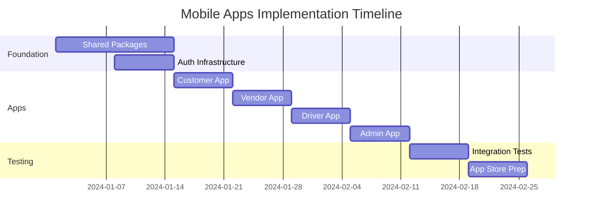

# 🚀 **Tap2Go Mobile Apps Implementation Plan**
## **Multi-App Strategy: Customer, Vendor, Driver & Admin Mobile Apps**

---

## 📊 **Current State Analysis**

### **✅ What We Have**
- **Single Mobile App**: `apps/mobile` (customer-focused, React Native + Expo)
- **Robust Web Architecture**: Separate panels for admin, vendor, driver, customer
- **Shared Packages**: Well-structured monorepo with 8 shared packages
- **Enterprise Auth**: Firebase-based authentication with role management
- **Solid Foundation**: NativeWind, React Navigation, Cart Context

### **🎯 What We Need**
- **4 Separate Mobile Apps**: Customer, Vendor, Driver, Admin
- **Shared Infrastructure**: Auth, API, UI components, business logic
- **App-Specific Logic**: Role validation, navigation, features per app

---

## 🏗️ **Implementation Strategy**

### **Phase 1: Infrastructure Preparation (Week 1-2)**

#### **1.1 Enhance Shared Packages**
```bash
# Current packages structure is excellent, enhance with mobile-specific exports
packages/
├── shared-types/           ✅ Already has User, roles, interfaces
├── firebase-config/        ✅ Already configured for web & mobile  
├── api-client/            ✅ Already has axios setup
├── shared-ui/             ⚠️  Needs mobile components
├── business-logic/        ✅ Already has order calculations
├── database/              ✅ Already has Firestore operations
├── shared-utils/          ✅ Already has utilities
└── config/                ✅ Already has environment config
```

#### **1.2 Create Mobile-Specific Shared Packages**
```bash
# New packages for mobile-specific needs
packages/
├── mobile-auth/           🆕 Mobile auth infrastructure
├── mobile-navigation/     🆕 Shared navigation components
├── mobile-ui/            🆕 React Native UI components
└── mobile-utils/         🆕 Mobile-specific utilities
```

### **Phase 2: Restructure Current Mobile App (Week 2-3)**

#### **2.1 Rename and Enhance Customer App**
```bash
# Rename current mobile app
mv apps/mobile apps/mobile-customer

# Update package.json
{
  "name": "mobile-customer",
  "displayName": "Tap2Go - Food Delivery"
}
```

#### **2.2 Extract Shared Mobile Components**
```typescript
// Move to packages/mobile-ui/
- FooterNavigation → CustomerFooterNav (app-specific)
- MobileHeader → SharedMobileHeader (reusable)
- RestaurantCard → SharedRestaurantCard (reusable)
- ResponsiveContainer → SharedResponsiveContainer (reusable)
```

### **Phase 3: Create New Mobile Apps (Week 3-5)**

#### **3.1 Vendor Mobile App**
```bash
# Create vendor app structure
apps/mobile-vendor/
├── package.json           # "Tap2Go Vendor - Restaurant Management"
├── app.json              # Vendor-specific app config
├── src/
│   ├── navigation/
│   │   └── VendorNavigator.tsx    # Orders, Menu, Analytics, Settings
│   ├── screens/
│   │   ├── DashboardScreen.tsx    # Vendor dashboard
│   │   ├── OrdersScreen.tsx       # Incoming orders
│   │   ├── MenuScreen.tsx         # Menu management
│   │   ├── AnalyticsScreen.tsx    # Sales analytics
│   │   └── SettingsScreen.tsx     # Vendor settings
│   ├── contexts/
│   │   └── VendorContext.tsx      # Vendor-specific state
│   └── auth/
│       └── VendorAuth.tsx         # Vendor role validation
```

#### **3.2 Driver Mobile App**
```bash
# Create driver app structure  
apps/mobile-driver/
├── package.json           # "Tap2Go Driver - Delivery Partner"
├── app.json              # Driver-specific app config
├── src/
│   ├── navigation/
│   │   └── DriverNavigator.tsx    # Map, Orders, Earnings, Profile
│   ├── screens/
│   │   ├── MapScreen.tsx          # Live map with orders
│   │   ├── OrdersScreen.tsx       # Available/active orders
│   │   ├── EarningsScreen.tsx     # Driver earnings
│   │   └── ProfileScreen.tsx      # Driver profile
│   ├── contexts/
│   │   └── DriverContext.tsx      # Driver-specific state
│   └── auth/
│       └── DriverAuth.tsx         # Driver role validation
```

#### **3.3 Admin Mobile App**
```bash
# Create admin app structure
apps/mobile-admin/
├── package.json           # "Tap2Go Admin - Management Console"
├── app.json              # Admin-specific app config  
├── src/
│   ├── navigation/
│   │   └── AdminNavigator.tsx     # Dashboard, Users, Analytics, Settings
│   ├── screens/
│   │   ├── DashboardScreen.tsx    # Admin overview
│   │   ├── UsersScreen.tsx        # User management
│   │   ├── AnalyticsScreen.tsx    # Platform analytics
│   │   └── SettingsScreen.tsx     # System settings
│   ├── contexts/
│   │   └── AdminContext.tsx       # Admin-specific state
│   └── auth/
│       └── AdminAuth.tsx          # Admin role validation
```

---

## 🔐 **Authentication Architecture**

### **Shared Infrastructure (packages/mobile-auth/)**
```typescript
// packages/mobile-auth/src/core.ts
export const authCore = {
  // Shared Firebase methods (NO business logic)
  signIn: (email: string, password: string) => 
    signInWithEmailAndPassword(auth, email, password),
  
  signOut: () => firebaseSignOut(auth),
  
  resetPassword: (email: string) => 
    sendPasswordResetEmail(auth, email),
    
  // Shared token management
  getIdToken: () => auth.currentUser?.getIdToken(),
};
```

### **App-Specific Authentication**
```typescript
// apps/mobile-vendor/src/auth/VendorAuth.tsx
export const useVendorAuth = () => {
  const signIn = async (email: string, password: string) => {
    // Use shared infrastructure
    const result = await authCore.signIn(email, password);
    
    // VENDOR-SPECIFIC validation (NOT shared)
    if (result.user.role !== 'vendor') {
      throw new Error('This app is for restaurant partners only');
    }
    
    // VENDOR-SPECIFIC setup (NOT shared)
    await loadVendorProfile(result.user.id);
    await initializeVendorDashboard();
    
    return result;
  };
};
```

---

## 📱 **App Store Strategy**

### **App Configurations**
```javascript
// apps/mobile-customer/app.json
{
  "expo": {
    "name": "Tap2Go - Food Delivery",
    "slug": "tap2go-customer",
    "scheme": "tap2go-customer",
    "bundleIdentifier": "com.tap2go.customer",
    "android": {
      "package": "com.tap2go.customer"
    }
  }
}

// apps/mobile-vendor/app.json  
{
  "expo": {
    "name": "Tap2Go Vendor",
    "slug": "tap2go-vendor", 
    "scheme": "tap2go-vendor",
    "bundleIdentifier": "com.tap2go.vendor",
    "android": {
      "package": "com.tap2go.vendor"
    }
  }
}
```

---

## 🔄 **Shared Code Strategy**

### **What TO Share**
```typescript
// ✅ Infrastructure (packages/firebase-config/)
- Firebase configuration
- Core auth methods
- API client setup

// ✅ UI Components (packages/mobile-ui/)  
- RestaurantCard, LoadingSpinner, etc.
- Design system components
- Reusable layouts

// ✅ Business Logic (packages/business-logic/)
- Order calculations
- Validation rules
- Data transformations

// ✅ Types (packages/shared-types/)
- User, Order, Restaurant interfaces
- API response types
- Common enums
```

### **What NOT TO Share**
```typescript
// ❌ App-Specific Logic
- Role validation (vendor vs customer vs driver)
- Navigation structures
- App-specific contexts
- Business workflows per user type
- App-specific UI layouts
```

---

## 📋 **Development Workflow**

### **Package Scripts Update**
```json
// Root package.json
{
  "scripts": {
    "mobile:customer": "turbo run dev --filter=mobile-customer",
    "mobile:vendor": "turbo run dev --filter=mobile-vendor", 
    "mobile:driver": "turbo run dev --filter=mobile-driver",
    "mobile:admin": "turbo run dev --filter=mobile-admin",
    "mobile:all": "turbo run dev --filter=mobile-*",
    "build:mobile": "turbo run build --filter=mobile-*"
  }
}
```

### **Turbo Configuration**
```json
// turbo.json - Add mobile app tasks
{
  "tasks": {
    "dev": {
      "cache": false,
      "persistent": true
    },
    "build:android": {
      "dependsOn": ["^build"],
      "outputs": ["android/app/build/**"]
    },
    "build:ios": {
      "dependsOn": ["^build"], 
      "outputs": ["ios/build/**"]
    }
  }
}
```

---

## 🚀 **Next Steps**

### **Week 1-2: Foundation**
- [ ] Create mobile-specific shared packages
- [ ] Extract reusable components from current mobile app
- [ ] Set up shared authentication infrastructure

### **Week 3: Customer App**
- [ ] Rename `apps/mobile` → `apps/mobile-customer`
- [ ] Integrate with shared packages
- [ ] Enhance customer-specific features

### **Week 4: Vendor App**
- [ ] Create `apps/mobile-vendor`
- [ ] Implement vendor navigation and screens
- [ ] Add vendor-specific authentication

### **Week 5: Driver & Admin Apps**
- [ ] Create `apps/mobile-driver` and `apps/mobile-admin`
- [ ] Implement role-specific features
- [ ] Test all apps with shared packages

### **Week 6: Testing & Deployment**
- [ ] End-to-end testing across all apps
- [ ] App Store preparation
- [ ] CI/CD pipeline setup

---

## 🎯 **Key Benefits of This Approach**

### **Industry-Validated Strategy**
- **Follows patterns used by**: Uber, DoorDash, Lyft, Twitter, Facebook
- **Shared infrastructure**: Reduces duplication, ensures consistency
- **App-specific logic**: Maintains clean separation of concerns

### **Technical Advantages**
- **Faster Development**: Reuse 70% of code across apps
- **Easier Maintenance**: Update shared logic once, affects all apps
- **Better Performance**: Smaller app bundles, focused features
- **Independent Releases**: Deploy updates per app as needed

### **Business Benefits**
- **App Store Optimization**: Better discoverability per user type
- **Targeted Features**: GPS for drivers, inventory for vendors
- **User Experience**: Focused interfaces without role switching
- **Marketing**: Separate branding and messaging per audience

---

## 📊 **Implementation Timeline**



---

## 🔧 **Technical Implementation Details**

### **Shared Package Dependencies**
```json
// Each mobile app will depend on:
{
  "dependencies": {
    "shared-types": "workspace:*",           // ✅ Already exists
    "firebase-config": "workspace:*",        // ✅ Already exists
    "api-client": "workspace:*",            // ✅ Already exists
    "business-logic": "workspace:*",        // ✅ Already exists
    "mobile-auth": "workspace:*",           // 🆕 New package
    "mobile-ui": "workspace:*",             // 🆕 New package
    "mobile-navigation": "workspace:*",     // 🆕 New package
    "mobile-utils": "workspace:*"           // 🆕 New package
  }
}
```

### **Metro Configuration for All Apps**
```javascript
// Shared metro.config.js template for all mobile apps
const { getDefaultConfig } = require('expo/metro-config');
const path = require('path');

const projectRoot = __dirname;
const monorepoRoot = path.resolve(projectRoot, '../..');

const config = getDefaultConfig(projectRoot);

// Watch shared packages
config.watchFolders = [
  projectRoot,
  path.resolve(monorepoRoot, 'packages/shared-types'),
  path.resolve(monorepoRoot, 'packages/firebase-config'),
  path.resolve(monorepoRoot, 'packages/api-client'),
  path.resolve(monorepoRoot, 'packages/mobile-auth'),
  path.resolve(monorepoRoot, 'packages/mobile-ui'),
];

// Resolve shared packages
config.resolver.nodeModulesPaths = [
  path.resolve(projectRoot, 'node_modules'),
  path.resolve(monorepoRoot, 'node_modules'),
];

module.exports = config;
```

### **App-Specific Navigation Examples**
```typescript
// apps/mobile-customer/src/navigation/CustomerNavigator.tsx
export default function CustomerNavigator() {
  return (
    <Stack.Navigator>
      <Stack.Screen name="Home" component={HomeScreen} />
      <Stack.Screen name="Search" component={SearchScreen} />
      <Stack.Screen name="Cart" component={CartScreen} />
      <Stack.Screen name="Orders" component={OrdersScreen} />
      <Stack.Screen name="Account" component={AccountScreen} />
    </Stack.Navigator>
  );
}

// apps/mobile-vendor/src/navigation/VendorNavigator.tsx
export default function VendorNavigator() {
  return (
    <Stack.Navigator>
      <Stack.Screen name="Dashboard" component={VendorDashboardScreen} />
      <Stack.Screen name="Orders" component={VendorOrdersScreen} />
      <Stack.Screen name="Menu" component={MenuManagementScreen} />
      <Stack.Screen name="Analytics" component={VendorAnalyticsScreen} />
      <Stack.Screen name="Settings" component={VendorSettingsScreen} />
    </Stack.Navigator>
  );
}
```

---

## 🚦 **Quality Assurance Strategy**

### **Testing Approach**
- **Unit Tests**: Shared packages (business logic, utilities)
- **Integration Tests**: Authentication flows per app
- **E2E Tests**: Critical user journeys per app type
- **Performance Tests**: App bundle sizes, load times

### **Code Quality**
- **Shared ESLint Config**: Consistent code style across all apps
- **TypeScript Strict Mode**: Type safety for all shared packages
- **Automated Testing**: CI/CD pipeline for all apps
- **Code Reviews**: Mandatory reviews for shared package changes

---

## 📈 **Success Metrics**

### **Development Metrics**
- **Code Reuse**: Target 70% shared code across apps
- **Build Time**: <5 minutes per app
- **Bundle Size**: <50MB per app
- **Development Speed**: 50% faster feature development

### **Business Metrics**
- **App Store Ratings**: >4.5 stars per app
- **User Engagement**: Higher retention per user type
- **Feature Adoption**: Faster adoption of role-specific features
- **Support Tickets**: Reduced confusion from role-specific UI

---

**This comprehensive plan transforms your current single mobile app into a professional multi-app ecosystem while leveraging your existing excellent monorepo architecture. The approach follows industry best practices and ensures scalable, maintainable code sharing.**
